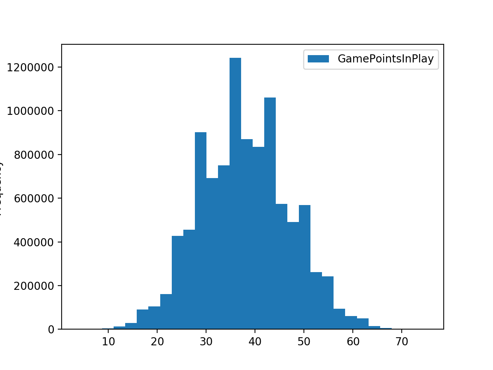
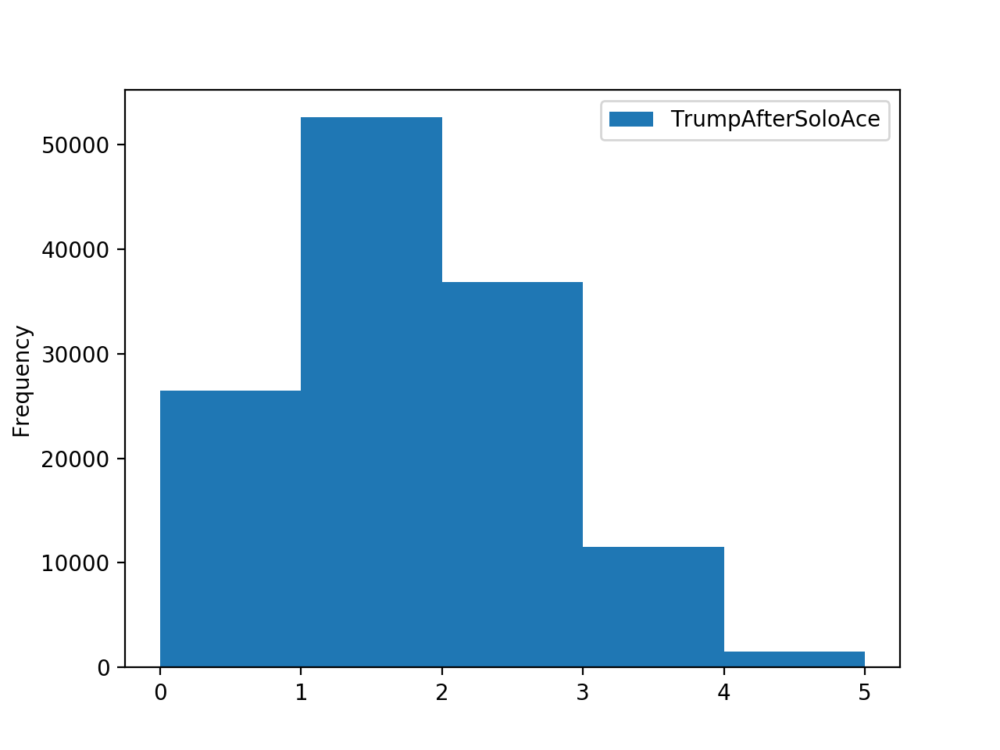

# Pitch-Analytics

```
https://en.wikipedia.org/wiki/Pitch_(card_game)
```



# Average Number of Game Points in Play

```
Simulation Stats:

       GamePointsInPlay
count    1000000.000000
mean          37.910833
std            9.131235
min            5.000000
25%           31.000000
50%           38.000000
75%           44.000000
max           73.000000
```

# Number of Trump Cards after Bidding on Lone Ace
```
Simulation Stats:

Solo-Ace bid 0.129926 of the time
Liklihood of at least one new trump 0.7948909379185075

       TrumpAfterSoloAce
count      129926.000000
mean            1.299825
std             0.937752
min             0.000000
25%             1.000000
50%             1.000000
75%             2.000000
max             5.000000
```




# Example Pitch Simulation:
# Original Hand

A full card deck is created and dealt to 4 players:
```
Player 0 -  [Q_hearts, 2_diamonds, 2_hearts, 6_hearts, 4_diamonds, 3_hearts]
Player 1 -  [7_hearts, 3_diamonds, 9_hearts, 4_hearts, 7_clubs, 9_diamonds]
Player 2 -  [8_clubs, 4_clubs, 6_clubs, J_diamonds, 10_clubs, Q_diamonds]
Player 3 -  [A_hearts, 5_spades, 4_spades, 8_hearts, 5_hearts, 3_clubs]
```

# Bid and Turn-In

There is a valuation for each hand and the players with higher valuations are more likely to be the winning bidder. 
```
player 3 bids with best card A_hearts

0 [Q_hearts, 2_hearts, 6_hearts, 3_hearts]
1 [7_hearts, 9_hearts, 4_hearts]
2 []
3 [A_hearts, 8_hearts, 5_hearts]
```

# After Exchange

The winning bidder picks their best card and all players are assumed to discard all non-trump and keep all trump:
```
Player 0 -  [Q_hearts, 2_hearts, 6_hearts, 3_hearts, 7_spades, A_clubs]
Player 1 -  [7_hearts, 9_hearts, 4_hearts, A_spades, 10_spades, K_clubs]
Player 2 -  [K_hearts, 10_hearts, J_hearts, A_diamonds, 6_spades, 9_spades]
Player 3 -  [A_hearts, 8_hearts, 5_hearts, 5_diamonds, J_spades, 7_diamonds]

```
