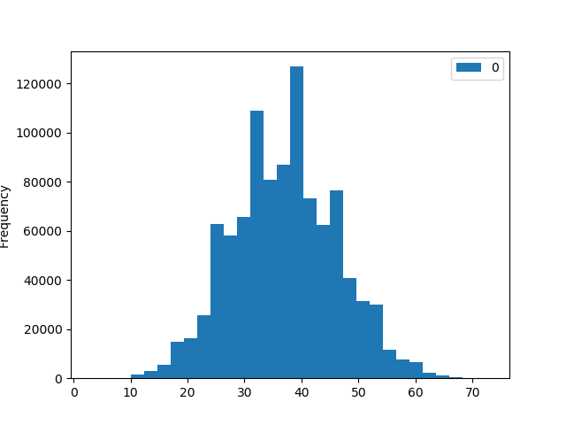

# Pitch-Analytics
# Average Number of Game Points in Play



#Simulation Stats:
```
count  1000000.000000
mean        36.921515
std          9.177131
min          3.000000
25%         30.000000
50%         37.000000
75%         43.000000
max         73.000000
```

#Example:
##Original Hand
```
Player 0  [7_clubs, Q_diamonds, 7_hearts, A_spades, 10_diamonds, A_hearts]
Player 1  [K_hearts, 2_clubs, 5_clubs, 10_hearts, 6_clubs, 3_hearts]
Player 2  [5_spades, 4_hearts, 8_clubs, K_clubs, 9_spades, A_clubs]
Player 3  [4_diamonds, 6_spades, 4_clubs, J_clubs, 3_clubs, 9_hearts]
```

#Turn-in
```
0 [7_hearts, A_hearts]
1 [K_hearts, 10_hearts, 3_hearts]
2 [4_hearts]
3 [9_hearts]
```

#After Exchange
```
Player 0  [7_hearts, A_hearts, Q_spades, J_diamonds, A_diamonds, 3_diamonds]
Player 1  [K_hearts, 10_hearts, 3_hearts, 10_spades, 7_diamonds, J_hearts]
Player 2  [4_hearts, 5_diamonds, K_diamonds, 9_diamonds, 5_hearts, K_spades]
Player 3  [9_hearts, J_spades, 6_hearts, 10_clubs, 2_spades, Q_hearts]
```
