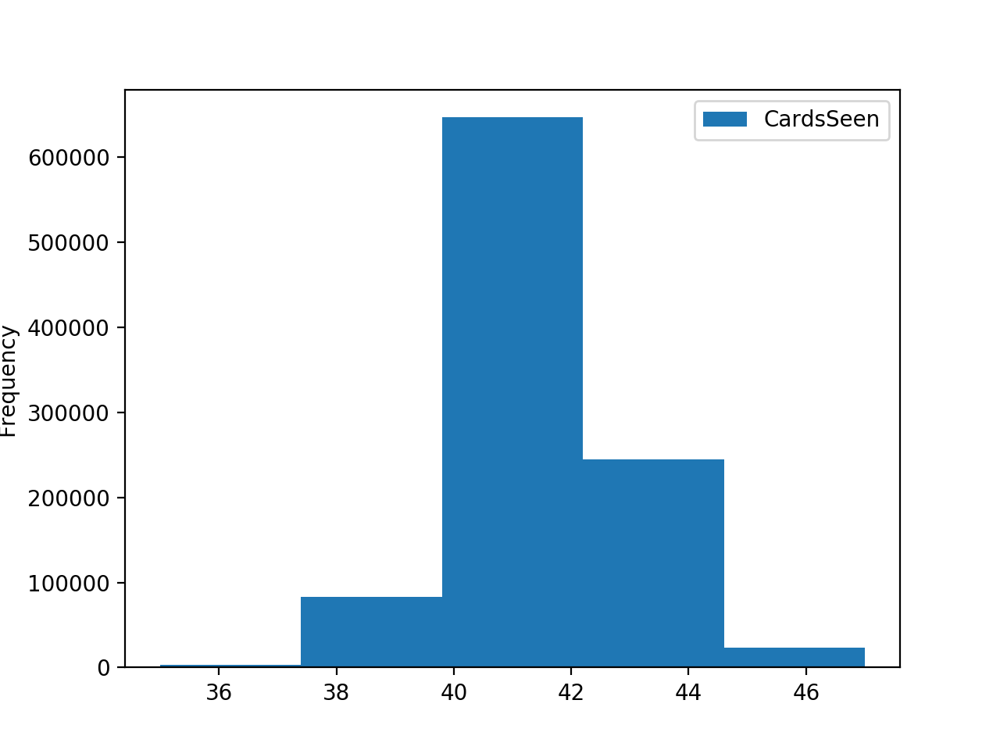

# Pitch-Analytics

“Half the variations which are calculated in a tournament game turn out to be completely superfluous. Unfortunately, no one knows in advance which half.” – Jan Timman


The purpose of this repo is to better understand the card game of Pitch - a rare and compelling card game that can best be described as a team-based adaptation of High-Low-Jack. All those who play are obsessed. 

```
https://en.wikipedia.org/wiki/Pitch_(card_game)
```

# Average Number of Game Points in Play
Problem:
How many game points on average are in play at the start of game-play (after bidding and exchanging cards) ? 

Below is the distribution of the total number game points in play after bidding and exchange, after 1,000,000 simulations of dealing cards, bidding and exchanging cards and summing the total game points. 

See AvgGamePoints.py for the simulation code and the PitchDeck class in CardDeck.py for all related methods.

```
Simulation Stats:

       GamePointsInPlay
count    1000000.000000
mean          37.910833
std            9.131235
min            5.000000
25%           31.000000
50%           38.000000
75%           44.000000
max           73.000000
```


# Total Cards Seen
Problem: 
After the initial deal and the exchange, how many cards have been seen by any player and how many are still left in the deck?

Simulations consist of a deal and exchange, and recording how far into the deck each hand went. See CardsSeen.py for simulations and PitchDeck class for methods.

```
Simulation Stats:

            CardsSeen
count  1000000.000000
mean        41.558735
std          1.520464
min         35.000000
25%         41.000000
50%         42.000000
75%         43.000000
max         47.000000
```


# Number of Trump Cards after Bidding on Lone Ace

Problem:
What is the liklihood of an additional trump card after bidding on only an Ace? What is the average number of trump cards to expect?

Simulations were run in which players were dealt, bid and exchanged cards. In the cases in which the winning bidder had only an ace of trump (12.9%), the number of trump cards the bidder received on the card exchange was recorded and the distribution shown below.

See TrumpAfterAce.py for the simulation and PitchDeck class for related methods.

```
Simulation Stats:

Solo-Ace bid 0.129926 of the time
Liklihood of at least one new trump 0.7948909379185075

       TrumpAfterSoloAce
count      129926.000000
mean            1.299825
std             0.937752
min             0.000000
25%             1.000000
50%             1.000000
75%             2.000000
max             5.000000
```


# Example Pitch Simulation:
# Original Hand

A full card deck is created and dealt to 4 players:
```
Player 0 -  [Q_hearts, 2_diamonds, 2_hearts, 6_hearts, 4_diamonds, 3_hearts]
Player 1 -  [7_hearts, 3_diamonds, 9_hearts, 4_hearts, 7_clubs, 9_diamonds]
Player 2 -  [8_clubs, 4_clubs, 6_clubs, J_diamonds, 10_clubs, Q_diamonds]
Player 3 -  [A_hearts, 5_spades, 4_spades, 8_hearts, 5_hearts, 3_clubs]
```

# Bid and Turn-In

There is a valuation for each hand and the players with higher valuations are more likely to be the winning bidder. 
```
player 3 bids with best card A_hearts

0 [Q_hearts, 2_hearts, 6_hearts, 3_hearts]
1 [7_hearts, 9_hearts, 4_hearts]
2 []
3 [A_hearts, 8_hearts, 5_hearts]
```

# After Exchange

The winning bidder picks their best card and all players are assumed to discard all non-trump and keep all trump:
```
Player 0 -  [Q_hearts, 2_hearts, 6_hearts, 3_hearts, 7_spades, A_clubs]
Player 1 -  [7_hearts, 9_hearts, 4_hearts, A_spades, 10_spades, K_clubs]
Player 2 -  [K_hearts, 10_hearts, J_hearts, A_diamonds, 6_spades, 9_spades]
Player 3 -  [A_hearts, 8_hearts, 5_hearts, 5_diamonds, J_spades, 7_diamonds]

```
